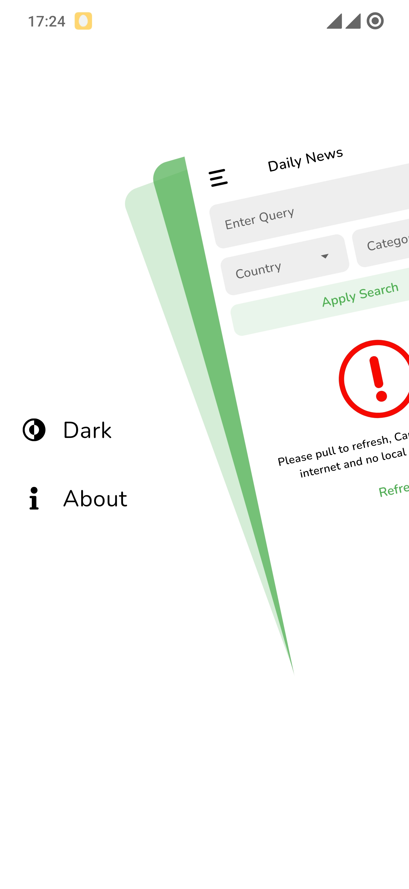
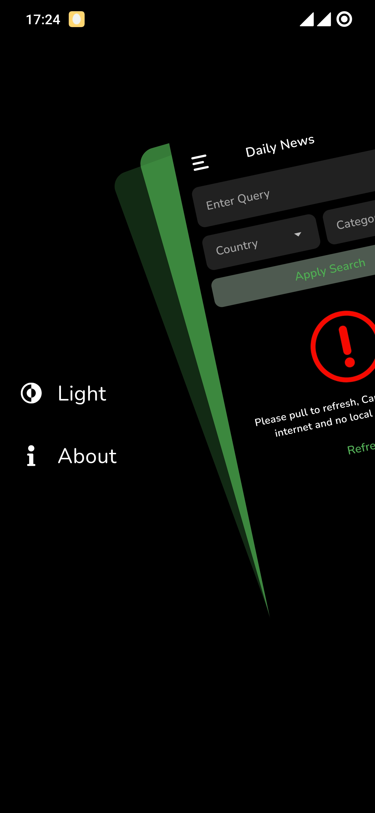
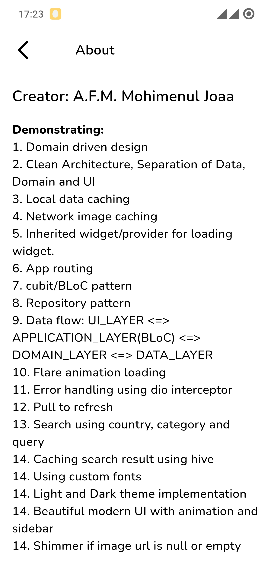
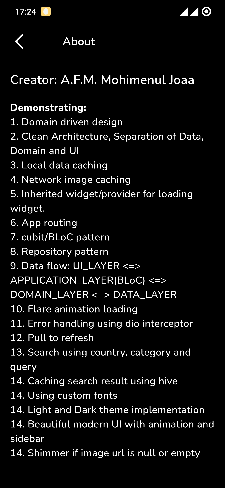
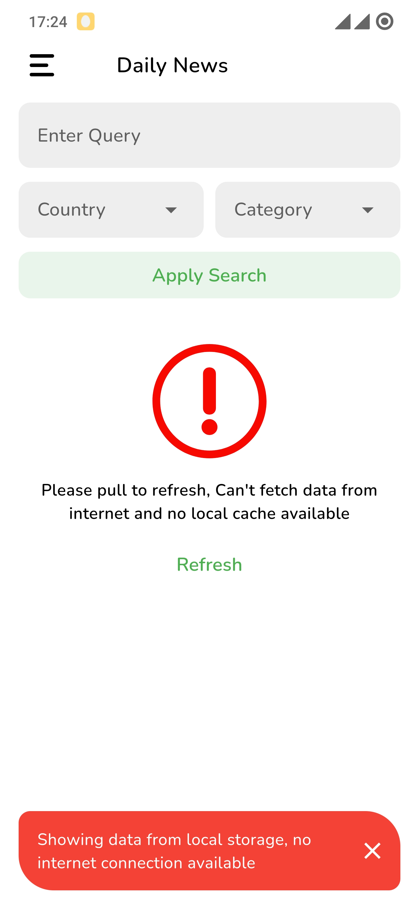
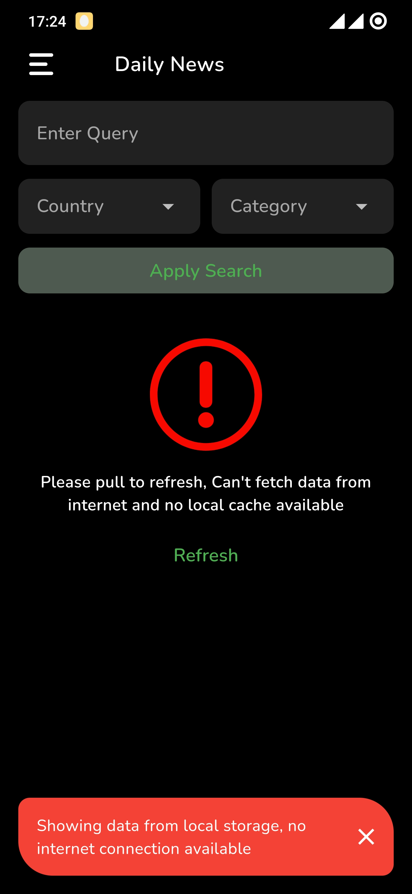

## Daily News App
### **Creator:**  A.F.M. MOHIMENUL JOAA

#### **Feature Description:**  
1. Fetch and Display: Fetch news articles from the NewsAPI Display them in a list with the
   article title, image, and a short description.
2. Detail View: On tapping a list item, navigate to a new screen that displays the full content of
   the article, including the image, title, content, and published date.
3. State Management: Implement a state management solution of your choice (RiverPod or
   Bloc) to manage and store the fetched articles.
4. Error Handling: Implement error handling for network failures or any other possible
   exceptions.
5. Pull to Refresh: Implement a pull-to-refresh feature that fetches the latest articles when the
   user pulls down on the list.
6. Caching: Cache the fetched articles to provide an offline reading experience.
7. Search Functionality: Allow users to search for specific articles by keyword.
8. Theming and UI/UX: Showcase your design and theming skills by styling the app beyond
   basic widgets.

### **Supported Platform:** 
Android, iOS, Web

## Features
- Material design
- Clean architecture using [Business Logic Component][BLC]
- Local data caching using [hive][H]
- Network image caching using [Cached Network Image][CNI]
- Inherited Widget using [provider][PV]
- App Routing
- Repository Pattern
- Flare animation using [Flare Flutter][PV]
- Proper Error Handling
- Proper Permission Handling
- Pull to refresh
- Domain driven design
- Search using country, category and query
- Caching search result using hive
- Using custom fonts
- Light and Dark theme implementation
- Beautiful modern UI with animation and sidebar
- Shimmer if image url is null or empty [shimmer][SS]

## Screenshot
### Dashboard/Home

  
  

### Detail Page

  
  

### Sidebar

  
  

### About page

  
  

### No Internet Dashboard

  
  

## Build Requirements
| SDK     | Version           |
|---------|-------------------|
| Dart    | [3.1.3][DART-31]  |
| Flutter | [3.13.6][FLU-313] |

## Dependency

| Dev Dependencies             |
|------------------------------|
| [cupertino_icons][CI]        |
| [flutter_svg][FSVG]          |
| [flutter_zoom_drawer][FZD]   |
| [logging][LG]                |
| [freezed_annotation][FA]     |
| [json_annotation][JA]        |
| [bloc][BLC]                  |
| [flutter_bloc][FBLC]         |
| [provider][PV]               |
| [flare_flutter][PV]          |
| [dio][D]                     |
| [hive][H]                    |
| [intl][INTL]                 |
| [dartz][DTZ]                 |
| [get_it][GT]                 |
| [cached_network_image][CNI]  |
| [flutter_cache_manager][FCM] |
| [path_provider][PP]          |
| [shimmer][SS]                |

## License
GNU AFFERO GENERAL PUBLIC LICENSE

[CI]: <https://pub.dev/packages/cupertino_icons>
[FSVG]: <https://pub.dev/packages/flutter_svg>
[FZD]: <https://pub.dev/packages/flutter_zoom_drawer>
[FA]: <https://pub.dev/packages/freezed_annotation>
[LG]: <https://pub.dev/packages/logging>
[BLC]: <https://pub.dev/packages/bloc>
[FBLC]: <https://pub.dev/packages/flutter_bloc>
[PV]: <https://pub.dev/packages/provider>
[FF]: <https://pub.dev/packages/flare_flutter>
[D]: <https://pub.dev/packages/dio>
[H]: <https://pub.dev/packages/hive>
[INTL]: <https://pub.dev/packages/intl>
[DTZ]: <https://pub.dev/packages/dartz>
[GT]: <https://pub.dev/packages/get_it>
[CNI]: <https://pub.dev/packages/cached_network_image>
[FCM]: <https://pub.dev/packages/flutter_cache_manager>
[PP]: <https://pub.dev/packages/path_provider>
[SS]: <https://pub.dev/packages/shimmer>
[JA]: <https://pub.dev/packages/json_annotation>
[DART-31]: <https://dart.dev/guides/language/evolution#dart-31>
[FLU-313]: <https://docs.flutter.dev/release/release-notes/release-notes-3.13.0>